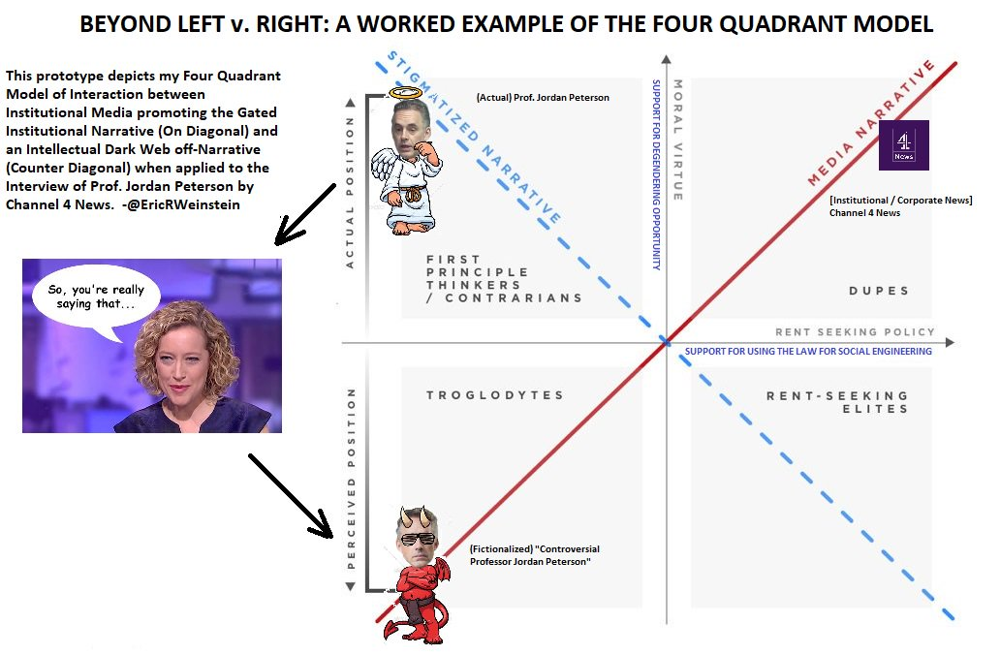

# Four Quadrant Model

> **The Four Quadrant Model** introduced on my [@SamHarrisOrg](https://samharris.org/podcasts/faith-in-reason/) episode &amp; then developed on [@RubinReport](https://www.youtube.com/watch?v=ofDXJsKsA30)&#39;s was created to explain incidents like the recent [@jordanbpeterson](https://twitter.com/jordanbpeterson) interview by [@cathynewman](https://twitter.com/cathynewman) of [@Channel4News](https://twitter.com/Channel4News) which all-fit-this-pattern.
>
> It&#39;s pretty clean.
>
> 

&mdash; Eric Weinstein (@EricRWeinstein) [January 20, 2018](https://twitter.com/EricRWeinstein/status/954860660436824064)

<iframe width="560" height="315" src="https://www.youtube-nocookie.com/embed/aMcjxSThD54" frameborder="0" allow="accelerometer; autoplay; clipboard-write; encrypted-media; gyroscope; picture-in-picture" allowfullscreen></iframe>

