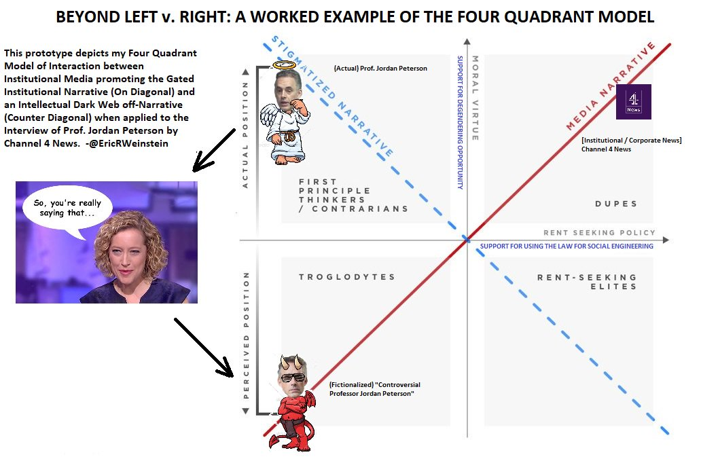

# Four Quadrant Model

> **The Four Quadrant Model* introduced on my <a href="https://twitter.com/SamHarrisOrg">@SamHarrisOrg</a> episode &amp; then developed on <a href="https://twitter.com/RubinReport?ref_src=twsrc%5Etfw">@RubinReport</a>&#39;s was created to explain incidents like the recent <a href="https://twitter.com/jordanbpeterson?ref_src=twsrc%5Etfw">@jordanbpeterson</a> interview by <a href="https://twitter.com/cathynewman?ref_src=twsrc%5Etfw">@cathynewman</a> of <a href="https://twitter.com/Channel4News?ref_src=twsrc%5Etfw">@Channel4News</a> which all-fit-this-pattern.
>
> It&#39;s pretty clean.
>
> 

&mdash; Eric Weinstein (@EricRWeinstein) [January 20, 2018](https://twitter.com/EricRWeinstein/status/954860660436824064)

<iframe width="560" height="315" src="https://www.youtube-nocookie.com/embed/aMcjxSThD54" frameborder="0" allow="accelerometer; autoplay; clipboard-write; encrypted-media; gyroscope; picture-in-picture" allowfullscreen></iframe>

