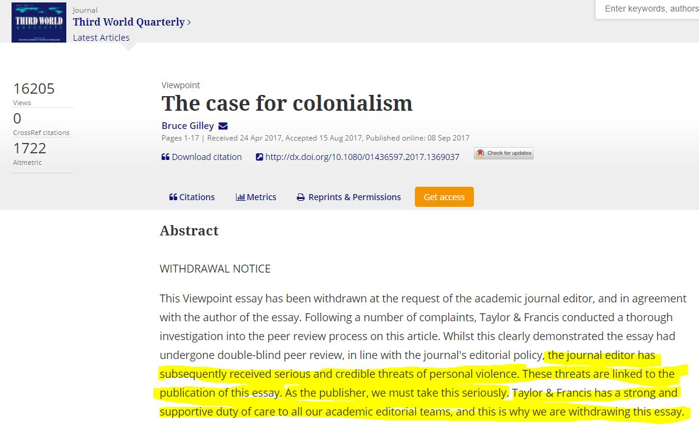

# Thug Review

> **Thug-Review**, n: a post Peer Review practice where threats of violence to life, limb, reputation & livelihood determine academic publication.
>
>
>Threats used to stop publication of "[Case for Colonialism](http://www.web.pdx.edu/~gilleyb/2_The%20case%20for%20colonialism_at2Oct2017.pdf)" gave it allure & mystique it should never have had. Here: [researchgate.net](https://www.researchgate.net/publication/319605242_The_case_for_colonialism)
